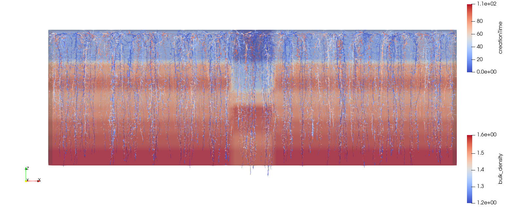

## **Parameterization of Root-Soil Interaction Models using Experimental Data** 

Parameterizing complex functional-structural models (CPlantBox/dumux-rosi) of root-soil interaction and investigating the effects of subsoil management technique, deep loosening, on root architecture development and root water uptake. - Master’s Thesis 2020/21.

## **Requirement**

OS: 
- Linux for the models
- Linux/Microsoft/Mac for post processing 

## **Installing**

Follow the installation steps in the document “Manual” to install both CPlantBox and dumux-rosi.

## **Code Documentation**

Go to [CPlantBox github repos](https://github.com/Plant-Root-Soil-Interactions-Modelling/CPlantBox) to learn more about the code 

## **Data**

The data used in this project can be obtained through personal communication from Prof. Andrea Schnepf, head of the group “Modelling soil-, root systems and rhizosphere processes” at Forschungszentrum Jülich GmbH, Institute of Bio- and Geosciences. 

## **Acknowledgement**

- Prof. Andrea Schnepf
- Dr. Sabine Seidel
- Dr. Miriam Athmann
- Dr. Julien Guigue
- Dr. Daniel Caviedes-Voulliѐme
- Mr. Deepanshu Khare
- Dr. Daniel Leitner
- Ms. Daniela Defavori
- Dr. Magdalena Landl
- Mr. Sibghat Ullah
